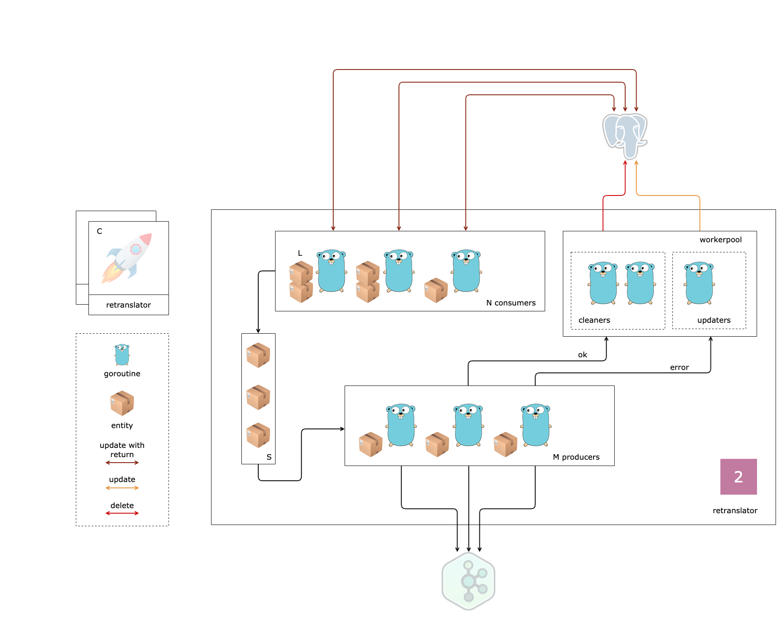

#### Задание 2

1. Создать репозиторий именование которого указано в таблице прогресса

2. Описать сущность `{domain}.{Subdomain}` и `{domain}.{Subdomain}Event` в **internal/model/{subdomain}.go**

3. Реализовать паттерн consumer-producer из **db** в **kafka** на основе интерфейсов`EventRepo` и `EventSender` для одного типа события **Created**

4. Написать тесты

5. Синхронизацию работы потоков сделать через `context` 💎

6. Создавать задачи у workerpool по обработке батчевых идентификаторов записей событий 💎

7. Поддержать несколько типов событий учитывая корректный порядок 💎

8. Реализовать гарантию доставки **At-least-once** 💎

9. Найти скрытые ошибки в коде 💎

**Рецепт**

[logistic-demo-api](https://github.com/ozonmp/logistic-demo-api)

P.S. Обратите внимание используется зеркальная (внешняя) точка зрения на вопрос, кто является потребителем, а кто является производителем.
Поэтому паттерн назвали **consumer-producer** и классы переименовали.
